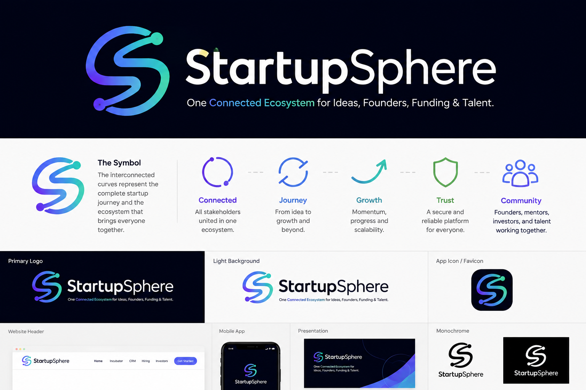

<div align="center">
  
  <h1>StartupSphere</h1>
  <p><b>One Connected Ecosystem for Ideas, Founders, Funding & Talent.</b></p>
  <p><a href="https://startupsphere-96dk.onrender.com/">🟢 <b>Live on Render: startupsphere-96dk.onrender.com</b></a></p>
</div>

---

## 🚀 Overview

**StartupSphere** is a comprehensive, centralized platform built to democratize entrepreneurship. Our mission is to bridge the gap between brilliant ideas and the capital, mentorship, and talent required to execute them flawlessly. Whether you're a student with a groundbreaking idea, an investor looking for the next unicorn, or a talented individual seeking to join an exciting startup, StartupSphere is your operating system for growth.

## ✨ Features

- **Role-Based Ecosystem**: Custom user models supporting diverse roles including Founders, Investors, Mentors, and Talent.
- **Modern SaaS UI**: A beautiful, highly responsive interface with frosted glass effects, dynamic themes (Light/Dark mode), and micro-animations.
- **Startup Incubation**: Register and track startups. Includes comprehensive idea management and tracking tools.
- **Admin Management**: Full Django admin integration to easily manage users, ideas, and registered startups.
- **Dynamic Dashboard**: Personalized dashboards with routing to distinct tools based on user permissions.
- **Secure Authentication**: Built-in, fully customized login and registration flows featuring progressive enhancements (e.g., password visibility toggles).

## 🛠️ Technology Stack

- **Backend**: Python 3.x, Django 5.x
- **Frontend**: HTML5, Vanilla CSS3 (Custom Variables), Bootstrap 5 (for grid and utilities), Vanilla JavaScript
- **Database**: SQLite (Development) -> PostgreSQL Ready (Production)
- **Architecture**: Modular Django app structure (`core`, `accounts`, `dashboard`, `incubator`)

## 💻 Installation & Setup

Follow these steps to run StartupSphere on your local machine.

### Prerequisites
- **Python 3.10+** installed
- **Git**

### Quickstart

1. **Clone the Repository**
   ```bash
   git clone https://github.com/Vineet375/Startup_Sphere.git
   cd Startup_Sphere/startup_sphere
   ```

2. **Create a Virtual Environment**
   ```bash
   python -m venv venv
   
   # Activate on Windows:
   .\venv\Scripts\activate
   
   # Activate on macOS/Linux:
   source venv/bin/activate
   ```

3. **Install Dependencies**
   ```bash
   # Note: The requirements.txt file is located inside the startup_sphere directory
   cd startup_sphere
   pip install -r requirements.txt
   ```

4. **Apply Database Migrations**
   ```bash
   python manage.py makemigrations
   python manage.py migrate
   ```

5. **Run the Development Server**
   ```bash
   python manage.py runserver
   ```
   Navigate to `http://127.0.0.1:8000/` in your browser to view the application!

## 🔐 Admin Access

A superuser account is pre-configured (or can be created via standard Django manage.py commands). 
Access the admin panel at `http://127.0.0.1:8000/admin`.

## 📁 Project Structure

```text
Startup_Sphere/
│
├── startup_sphere/                 # Main Django Project Root
│   ├── manage.py                   # Django management script
│   ├── config/                     # Core settings & URLs
│   │
│   ├── core/                       # Landing page, Base Models, Global Logic
│   ├── accounts/                   # Auth flows (Login, Register, Password Management)
│   ├── dashboard/                  # Personalized User Dashboards & Profiles
│   ├── incubator/                  # Startup & Idea Management Modules
│   │
│   ├── static/                     # Global static files (CSS, Images, JS)
│   └── templates/                  # Global and app-specific HTML templates
│
└── README.md
```

## 🤝 Contributing
StartupSphere is currently under active development. Upcoming features include the Funding CRM, Hiring portals, and internal Messaging systems. Stay tuned!
