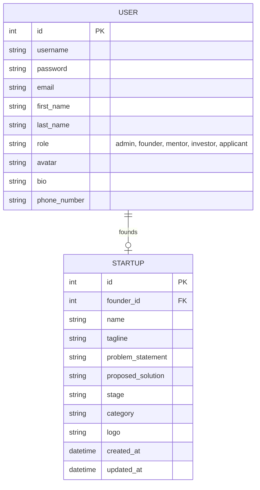

# Database Schema & ER Diagram

This document details the database schema for the StartupSphere project (Checkpoint 1 phase).

## Entity-Relationship Diagram

## Schema Details

### 1. `core_user` (Custom User Model)
Inherits from Django's `AbstractUser`.

| Field | Type | Constraints | Description |
|-------|------|-------------|-------------|
| id | Integer | PK | Primary Key |
| username | String | Unique | Login identifier |
| email | String | - | Email address |
| password | String | - | Hashed password |
| role | String | default='founder' | User Role: Admin, Founder, Mentor, Investor, Applicant |
| avatar | Image | null, blank | Profile picture |
| bio | Text | max=500 | Short biography |
| phone_number | String | max=15 | Contact number |

### 2. `incubator_startup`
Represents a startup profile created by a Founder.

| Field | Type | Constraints | Description |
|-------|------|-------------|-------------|
| id | Integer | PK | Primary Key |
| founder | Integer | FK, OneToOne | Link to `core_user` (Founder) |
| name | String | max=200 | Startup Name |
| tagline | String | max=250 | Short description |
| problem_statement| Text | - | Detailed problem being solved |
| proposed_solution| Text | - | Detailed solution offered |
| stage | String | default='idea'| Current stage (idea, prototype, seed, etc.) |
| category | String | default='other'| Industry category |
| logo | Image | null, blank | Startup logo |
| created_at | DateTime| auto_now_add | Creation timestamp |
| updated_at | DateTime| auto_now | Last update timestamp |
